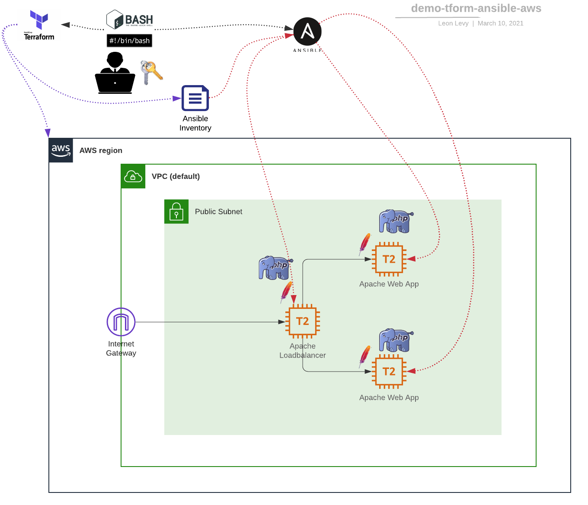

# Create and deploy an Apache LB and two Apache web hosts

- Uses Terraform to deploy three identical EC2 instances
- Terraform will dynamically generate an Ansible inventory file 'host-dev'
- It will also dynamically create an SSH keypair and place the private key in this directory.



Once all three instances have been deploployed, run the Ansible playbook
`playbooks/all-playbooks.yml`

command: `ansible-playbook playbooks/all-playbooks.yml`

Ansible will update and install Apache on all server and configure the first host to be
a loadbalancer. Ansible will then deploy a PHP website to the other two servers that is accessed through the loadbalancer.

Once complete, you can connect to the IP address of the LB to view the main webpage

To test out loadbalancer, add /info.pho to the end of the LB IP address, and refresh to see
loadbalancing in action... exiting!!!

`http://<lb IP address>/info.php`

## Instructions for included scripts
### Prereqs:

- Ansible and Terraform are installed on your local system

On a Mac:

`brew install terraform ansible`

- The AWS CLI has been installed and configured with your access key and key ID on the local system

### Provision VMs and configure loadbalancer and web servers
Note: Output will provide a link to access the website and test load balancer

`sh provision_and_config.sh`

## Clean up VMs when you are done
Note: This will delete all of the VMs, but will prompt you before doing so.

`sh cleanup.sh`

#### Other random stuff

Some adhoc commands:

```
ansible -m ping all
ansible -m shell -a "uname" webservers:loadbalancers
ansible -m shell -a "uname" all 

```

Module Index:
https://docs.ansible.com/ansible/2.9/modules/modules_by_category.html

playbooks commands:

```
ansible-playbook playbooks/ping.yml
ansible-playbook playbooks/uname.yml
ansible-playbook playbooks/yum-update.yml
ansible-playbook playbooks/yum-update.yml 
ansible-playbook playbooks/setup-lb.yml

```


`ansible -m setup app1`  (get variable info on a system)

```
ansible -m setup app1 | grep ansible_hostname`
        `"ansible_hostname": "ip-172-31-1-131",

`ansible -m setup webservers | grep ansible_hostname`
        `"ansible_hostname": "ip-172-31-1-131",`
        `"ansible_hostname": "ip-172-31-3-65",`

```

check mode


`ansible-playbook playbooks/setup-app.yml --check`
